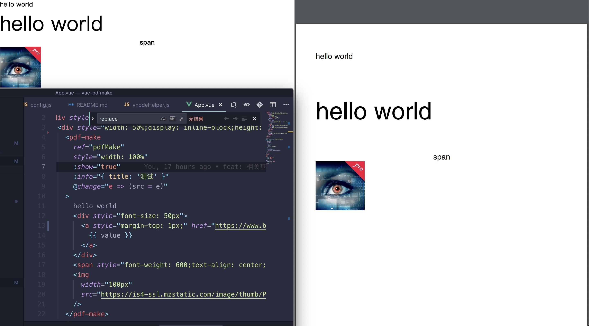

# vue-pdfmake

基于 pdfmake


## 一个 vue 组件，能够将内部的 slot 转为 pdf

项目基于 VNODE 将 vnode 按照一定的规则转为 pdfmake 的相关配置文件



## 文档

[查看文档](https://www.mizuka.top/vue-pdfmake/)

## Project setup

```
yarn install
```

### Compiles and hot-reloads for development

```
yarn run serve
```

### Compiles and minifies for production

```
yarn run build
```

### Lints and fixes files

```
yarn run lint
```
